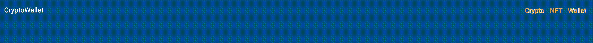
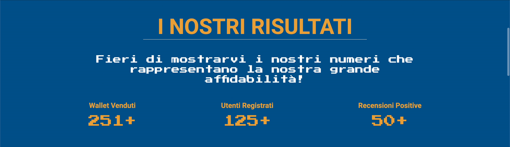
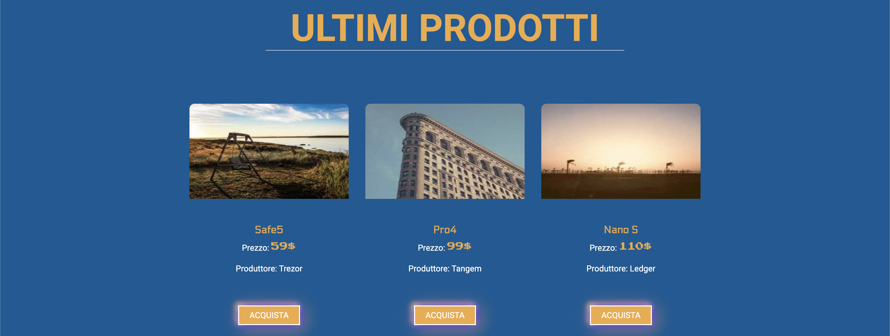

# CryptoWallet

"CryptoWallet" è un progetto front-end sviluppato con passione per rappresentare un mercato online di crypto wallet per la self custody. Questo sito web offre un'esperienza utente intuitiva e coinvolgente, grazie all'utilizzo di HTML, CSS, JavaScript, Bootstrap e AOS.

## Obiettivi del Progetto
L'obiettivo principale era creare un'interfaccia utente intuitiva e visivamente accattivante per un e-commerce di Wallet Crypto. 
Il sito include animazioni dinamiche, una barra di navigazione interattiva, sezioni di prodotto con immagini cliccabili e un modulo di iscrizione alla newsletter. 
E' stato progettato per garantire un layout moderno e funzionale ad una possibile futura implementazione della parte back-end.

## Tecnologie Utilizzate

 - *HTML5*
 - *CSS3*
 - *JavaScript*
 - *Bootstrap*
 - *AOS (Animate On Scroll)*

## Struttura del Progetto

Il progetto è organizzato nei seguenti file:

- **index.html**: La homepage del sito, che presenta l'introduzione con un'immagine rappresentativa di sfondo ed un'animazione, le liste dei marchi riguardanti i prodotti venduti sul sito, la sezione degli ultimi prodotti e delle recensioni dei clienti.

- **products.html**: Una pagina dedicata alla visualizzazione dettagliata dei prodotti disponibili, ognuno dei quali ha un'icona placeholder, un nome ed un prezzo. L'utente ha la possibilità di interagire con l'elenco dei prodotti e con la possibilità di impostare diversi filtri di ricerca. 
I prodotti presenti sono inseriti attraverso la logica presente nel file *products.js*.

- **style.css**: Il file CSS che definisce lo stile del sito, inclusi colori, font e layout responsivo.

- **main.js**: Il file JavaScript principale che gestisce l'interattività del sito, come la navigazione e le animazioni. Ecco le funzionalità principali: 

    - Navbar cambia comportamento al variare dello scroll e a seconda della posizione della pagina. 

    

    - Animazione per il conteggio progressivo di numeri, come Wallet venduti, Utenti registrati e Recensioni positive, che entra in azione solo quando l'elemento entra nella vista del browser.

    

    - Sezione "Ultimi prodotti" che mostra i Wallet più recenti, aggiungendoli dinamicamente con immagini e prezzi.
    
    

    - Sezione "Ultime recensioni" in cui vengono mostrate le recensioni dei clienti, mostrandole dinamicamente con immagini, descrizioni e indice di    gradimento rappresentato da icone Bootstrap a forma di stella.

    

- **products.js**: Contiene la logica per la gestione e visualizzazione dei prodotti, interagendo con il file *products.json*. Ecco le principali funzionalità più nel dettaglio:
    - I prodotti vengono creati dinamicamente a partire da un file JSON con la funzione fetch(), con la possibilità di visualizzare i dettagli di ciascun prodotto in card interattive. 

    - Sono stati implementati filtri per categoria, prezzo e ricerca per parola, permettendo all'utente di cercare e selezionare i prodotti in modo più mirato. I filtri agiscono in combinazione grazie a una funzione di "global filter" che aggiorna le card visibili in base alle preferenze selezionate dall'utente.

- **products.json**:  file JSON che contiene i dati dei prodotti: nome, descrizione, prezzo e immagini.

- **media/**: cartella che contiene tutte le immagini e le animazioni utilizzate nel sito.

## Design e Stile

Per il design, ho scelto una combinazione di colori che trasmette eleganza e naturalezza:
- **Sfondo**: rgb(0, 90, 149);
- **Testo titoli**: rgb(239, 170, 66);
- **Colore accento**: rgb(255, 255, 255);

I font utilizzati sono:
- **Electrolize** per i titoli
- **Roboto** per i paragrafi

Queste scelte contribuiscono a creare un'esperienza visiva piacevole per l'utente.
I fonts sono stati importati da Google Fonts.

## Considerazioni

Questo è il primo progetto realizzato come sviluppatore full-stack.
Attraverso **CryptoWallet**, ho potuto approfondire le mie competenze in sviluppo web, design responsivo e interattività.

Per ulteriori informazioni, non esitare a contattarmi!
---
